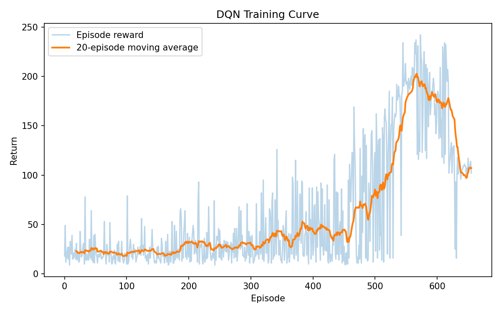

# DQN from Scratch

A clean, modular implementation of **Deep Q-Networks** (Mnih et al., 2015), built from first principles in PyTorch. This project includes the reinforcement-learning theory the algorithm is built on — the Bellman optimality equation and how Q-learning turns it into a trainable loss — alongside a small, well-tested codebase and real training results.


<p align="center">
  
</p>

*CartPole-v1, 40k environment steps, single seed. Raw episode return (light) and 20-episode moving average (dark). The trained greedy policy averages ~106 return over 20 evaluation episodes (see [Results](#results)).*

---

## Table of contents

- [Why DQN](#why-dqn)
- [The math](#the-math)
  - [Markov Decision Processes](#1-markov-decision-processes)
  - [The Bellman optimality equation](#2-the-bellman-optimality-equation)
  - [From Bellman equation to a learning rule](#3-from-bellman-equation-to-a-learning-rule)
  - [Function approximation and the DQN loss](#4-function-approximation-and-the-dqn-loss)
  - [Why replay buffers and target networks](#5-why-replay-buffers-and-target-networks)
  - [Overestimation bias & Double DQN](#6-overestimation-bias--double-dqn)
- [Project structure](#project-structure)
- [Installation](#installation)
- [Usage](#usage)
- [Results](#results)
- [Design notes](#design-notes)
- [Tests](#tests)
- [References](#references)

---

## Why DQN

Classic Q-learning stores a Q-value for every `(state, action)` pair in a table. That's fine for small, discrete state spaces, but it breaks down immediately for anything with a continuous or high-dimensional observation (e.g. raw pixels, or even CartPole's 4 continuous state variables) — the table would need to be infinite. **DQN's core idea is to replace the table with a neural network** `Q(s, a; θ)` that generalizes across states, and to train that network by turning the Bellman optimality equation into a supervised-learning-style regression target.

---

## The math

### 1. Markov Decision Processes

An agent interacts with an environment modeled as a Markov Decision Process (MDP), defined by the tuple `(S, A, P, R, γ)`:

- `S` — set of states
- `A` — set of actions
- `P(s' | s, a)` — transition probability of reaching state `s'` after taking action `a` in state `s`
- `R(s, a)` — expected reward for taking action `a` in state `s`
- `γ ∈ [0, 1)` — discount factor, trading off immediate vs. future reward

A **policy** `π(a | s)` maps states to a distribution over actions. The agent's objective is to find the policy that maximizes expected discounted return:

$$
G_t = \sum_{k=0}^{\infty} \gamma^k R_{t+k}
$$

### 2. The Bellman optimality equation

Define the **action-value function** `Q^π(s, a)` as the expected return starting from state `s`, taking action `a`, and then following policy `π`:

$$
Q^{\pi}(s, a) = \mathbb{E}_{\pi}\Big[\, G_t \;\Big|\; S_t = s,\, A_t = a \,\Big]
$$

The **optimal action-value function** is the best achievable `Q` over all policies:

$$
Q^*(s, a) = \max_{\pi} Q^{\pi}(s, a)
$$

Bellman's key insight is that this optimal value function must satisfy a *recursive consistency condition*: the value of taking action `a` in state `s` optimally equals the immediate reward plus the discounted value of behaving optimally from the next state onward. This is the **Bellman optimality equation**:

$$
Q^*(s, a) = \mathbb{E}_{s' \sim P(\cdot \mid s, a)}\Big[\, R(s, a) + \gamma \max_{a'} Q^*(s', a') \,\Big]
$$

Intuitively: *the best you can do now is the reward you get immediately, plus the best you can do from wherever you land next.* This equation has a unique fixed-point solution `Q*`, and if we know `Q*`, the optimal policy is simply greedy with respect to it:

$$
\pi^*(s) = \arg\max_{a} Q^*(s, a)
$$

This is what makes Q-learning attractive: we don't need to represent the policy explicitly at all — solving for `Q*` *is* solving the control problem.

### 3. From Bellman equation to a learning rule

Tabular Q-learning (Watkins, 1989) turns the Bellman equation into an iterative update rule. After observing a transition `(s, a, r, s')`, nudge the current estimate `Q(s, a)` toward the **TD (temporal-difference) target**:

{$$
y = r + \gamma \max_{a'} Q(s', a')
$$}

using the update:

{$$
Q(s, a) \leftarrow Q(s, a) + \alpha \Big[\, y - Q(s, a) \,\Big]
$$}

where `α` is a learning rate and the bracketed quantity `y - Q(s, a)` is the **TD error**. Repeating this over many transitions provably converges to `Q*` for tabular state-action spaces under standard stochastic approximation conditions.

### 4. Function approximation and the DQN loss

DQN replaces the table `Q(s, a)` with a neural network `Q(s, a; θ)`. Instead of directly overwriting table entries, we minimize the squared TD error over sampled transitions — i.e., we treat the TD target as a regression label and take a gradient step:

$$
\mathcal{L}(\theta) = \mathbb{E}_{(s,a,r,s') \sim \mathcal{D}}\Big[\, \big(y - Q(s, a; \theta)\big)^2 \,\Big], \qquad y = r + \gamma \max_{a'} Q(s', a'; \theta^{-})
$$

Two details distinguish this from naively regressing toward `y`:

- `θ⁻` denotes a separate **target network** whose weights are periodically copied from the online network `θ`, rather than updated every step (see [§5](#5-why-replay-buffers-and-target-networks)).
- `𝒟` is a **replay buffer** of past transitions sampled uniformly at random, rather than the single most recent transition.

This repo minimizes a **Huber loss** (`smooth_l1_loss`) instead of raw MSE — it behaves like MSE for small TD errors but like MAE for large ones, which keeps a handful of outlier transitions from dominating the gradient. See [`dqn/agent.py`](dqn/agent.py), method `learn()`.

### 5. Why replay buffers and target networks

The regression view above is deceptively simple — naively applying it online is unstable in practice, for two reasons this project's architecture directly addresses:

**Correlated, non-stationary data.** Consecutive transitions from a single trajectory are highly correlated, and gradient descent implicitly assumes i.i.d. samples. The **[`ReplayBuffer`](dqn/replay_buffer.py)** stores the last `N` transitions and samples uniformly at random each update, breaking temporal correlation and letting each transition be reused many times (better sample efficiency).

**A moving regression target.** In the loss above, the target `y` depends on the same weights `θ` we're updating. If we used `θ` (not `θ⁻`) inside the `max`, every gradient step would shift the target itself, i.e. the network is chasing a target that moves every time it moves — a well-known source of divergence in bootstrapped function approximation. Freezing a **target network** `θ⁻` and only copying `θ → θ⁻` every `target_update_interval` steps keeps the regression target fixed for long enough to actually converge toward.

### 6. Overestimation bias & Double DQN

The `max_{a'}` inside the Bellman target is a subtle problem: `Q(s', ·; θ⁻)` is a *noisy* estimate, and `max` of noisy estimates is a biased (upward) estimator of the true max — the network tends to systematically overestimate Q-values. **Double DQN** (van Hasselt et al., 2016) fixes this by decoupling *which* action is chosen from *how good* it's evaluated to be: use the **online** network to pick the best next action, and the **target** network to evaluate it.

$$
y_{\text{DoubleDQN}} = r + \gamma \, Q\Big(s', \; \underset{a'}{\arg\max}\, Q(s', a'; \theta); \; \theta^{-}\Big)
$$

This project implements both variants — toggle with `Config.use_double_dqn` — see [`dqn/agent.py`](dqn/agent.py).

---

## Project structure

```
dqn-from-scratch/
├── dqn/
│   ├── __init__.py          # public API
│   ├── config.py            # Config dataclass — every hyperparameter in one place
│   ├── network.py           # QNetwork: MLP mapping state -> Q-values
│   ├── replay_buffer.py     # fixed-size cyclic experience replay buffer
│   ├── agent.py             # action selection, Bellman-target computation, gradient step
│   └── utils.py             # seeding, running averages, plotting
├── tests/
│   ├── test_replay_buffer.py
│   ├── test_network.py
│   └── test_agent.py
├── configs/
│   └── cartpole.yaml        # example hyperparameter config
├── train.py                 # training entry point
├── evaluate.py               # load a checkpoint and run it greedily
├── assets/
│   └── training_curve.png
├── requirements.txt
├── setup.py
└── .github/workflows/tests.yml   # CI: runs the test suite on every push
```

Each module has a single responsibility and no circular dependencies: `network.py` and `replay_buffer.py` are pure, dependency-free building blocks; `agent.py` composes them into the actual algorithm; `train.py` / `evaluate.py` are thin scripts around the library code in `dqn/`.

## Installation

```bash
git clone https://github.com/<your-username>/dqn-from-scratch.git
cd dqn-from-scratch
pip install -r requirements.txt
# or, for an editable install:
pip install -e .
```

Requires Python 3.10+. Tested with `torch>=2.1` and `gymnasium>=0.29`.

## Usage

**Train** (defaults to CartPole-v1):

```bash
python train.py --env CartPole-v1 --steps 150000 --seed 0
# or from a yaml config:
python train.py --config configs/cartpole.yaml
```

Checkpoints, a config snapshot, raw episode rewards, and a training-curve PNG are written to `checkpoints/<run_name>/`.

**Evaluate** a trained checkpoint greedily (ε = 0):

```bash
python evaluate.py --checkpoint checkpoints/<run_name>/checkpoint_final.pt --episodes 20
python evaluate.py --checkpoint <path> --render   # watch it play
```

**Use the library directly:**

```python
from dqn import Config, DQNAgent
import gymnasium as gym

env = gym.make("CartPole-v1")
cfg = Config(total_steps=100_000, use_double_dqn=True)
agent = DQNAgent(obs_dim=4, n_actions=2, cfg=cfg)

state, _ = env.reset(seed=cfg.seed)
for step in range(1, cfg.total_steps + 1):
    action = agent.act(state, step)
    next_state, reward, terminated, truncated, _ = env.step(action)
    agent.remember(state, action, reward, next_state, terminated)
    if agent.ready_to_learn():
        agent.learn()
    state = next_state if not (terminated or truncated) else env.reset()[0]
```

## Results

Run configuration: `configs/cartpole.yaml`, single seed, 40,000 environment steps (a shortened run for a quick, reproducible demo — `total_steps: 150000` in the default config trains substantially further).

| Metric | Value |
|---|---|
| Environment | CartPole-v1 (max episode return: 500) |
| Training steps | 40,000 |
| Episodes to reach avg100 ≥ 100 | ~560 |
| Greedy eval return (20 episodes, ε=0) | **105.6 ± 5.7** |

The moving average climbs steadily from ~28 (near-random policy) to 150+ within 40k steps, well before epsilon finishes annealing — see the plot at the top of this README. Training longer (the default `total_steps=150000`) continues improving toward CartPole's max return of 500.

## Design notes

A few choices worth calling out explicitly, since they're easy to get subtly wrong:

- **`Config` as a dataclass, not scattered constants.** Every run's hyperparameters live in one serializable object (`Config.save` / `Config.load`), so any run's config gets snapshotted next to its checkpoints — reproducibility isn't an afterthought.
- **Replay buffer as pre-allocated NumPy arrays**, not a `deque` of tuples — sampling a batch is a few vectorized index operations instead of a Python loop, which matters once `buffer_capacity` reaches `10^5`–`10^6`.
- **Hard target updates** (periodic full copy) rather than soft/Polyak updates, matching the original DQN paper; both are valid, this one is simpler to reason about and verify with a unit test (`test_target_network_updates_periodically`).
- **Huber loss over MSE** for the TD error — robust to the occasionally large TD errors early in training, without needing to tune a separate reward-clipping scheme.
- **Gradient norm clipping** as a cheap insurance policy against occasional large updates destabilizing the policy.

## Tests

```bash
pytest -v
```

16 unit and integration tests cover the replay buffer's cyclic behavior and sampling correctness, the network's shapes and gradient flow, and the agent's action selection, learning step, and target-network update cadence. CI (`.github/workflows/tests.yml`) runs this suite on every push against Python 3.10 and 3.11.

## References

1. Mnih, V. et al. (2015). *Human-level control through deep reinforcement learning.* Nature 518, 529–533.
2. van Hasselt, H., Guez, A., & Silver, D. (2016). *Deep Reinforcement Learning with Double Q-learning.* AAAI.
3. Watkins, C.J.C.H. (1989). *Learning from Delayed Rewards.* PhD thesis, Cambridge.
4. Sutton, R.S. & Barto, A.G. (2018). *Reinforcement Learning: An Introduction* (2nd ed.). MIT Press.

## License

[MIT](LICENSE)
